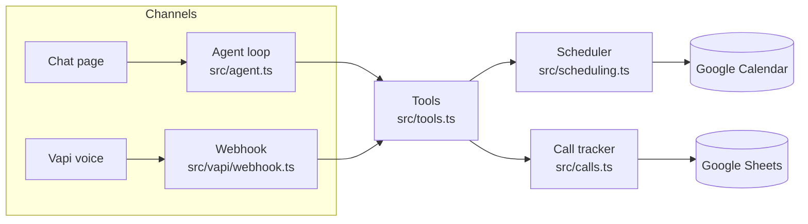

# Cedar Lane Auto Detailing: AI receptionist

An AI receptionist that answers for a small auto detailing shop. It books, moves and cancels appointments on **Google Calendar**, keeps a row per caller and a log of every call in **Google Sheets**, answers questions about prices, hours, prep and vehicle types, handles "I'm running late", and hands billing complaints to a person.

- **Phase 1** is a text chat agent with a basic web page on top.
- **Phase 2** puts the same agent on the phone with **Vapi**.

Stack: TypeScript on Node 20+, Google Gemini for the model (it has a free tier), Express for the server.

## Contents

1. [Quick start (no Google account needed)](#quick-start)
2. [Google setup](#google-setup)
3. [What the agent handles and what it hands off](#what-the-agent-handles-and-what-it-hands-off)
4. [How correctness is enforced](#how-correctness-is-enforced)
5. [What lands in the sheet](#what-lands-in-the-sheet)
6. [Testing](#testing)
7. [Phase 2: voice with Vapi](#phase-2-voice-with-vapi)
8. [Assumptions about the shop](#assumptions-about-the-shop)
9. [Project layout](#project-layout)
10. [Limits and next steps](#limits-and-next-steps)

## Quick start

```bash
npm install
cp .env.example .env        # then put your GEMINI_API_KEY in .env
npm run dev                 # http://localhost:3000
```

With no Google IDs in `.env` the server runs in **demo mode**: an in-memory calendar and sheet, pre-loaded with the test data described [below](#test-data). Open http://localhost:3000 and type what a caller would say. Each reply has a "tools" line you can expand to see exactly which tools ran and what they returned. `GET /api/state` shows the demo calendar, contacts and call log as JSON.

Try the conversation from the brief:

```
Is the 3:30 interior detail and wash appointment on Thursday open?
Sure, 4:30 works.
Sara, 415-555-0190.
```

### The model

The agent uses Google Gemini through its native API ([`src/gemini.ts`](src/gemini.ts)). Get a free key at [aistudio.google.com/apikey](https://aistudio.google.com/apikey) and set it in `.env`:

```
GEMINI_API_KEY=<your key>
GEMINI_MODEL=gemini-3.5-flash
LLM_MIN_INTERVAL_MS=6500
```

`LLM_MIN_INTERVAL_MS` spaces requests out to stay under the free tier's per-minute limit; adjust it to the limit AI Studio shows for your model, or set it to 0 on a paid key. Rate-limit and "model overloaded" responses are retried a few times automatically.

Values in `.env` take precedence over variables of the same name already set on your computer, and the server prints a note at startup when that happens.

## Google setup

The agent talks to Google as a **service account**: a robot user that you share one calendar and one sheet with. About ten minutes, once.

1. **Create a project and enable the APIs.** In [Google Cloud Console](https://console.cloud.google.com/) create a project, then enable **Google Calendar API** and **Google Sheets API** (APIs & Services → Library).
2. **Create a service account.** APIs & Services → Credentials → Create credentials → Service account. No roles are needed. Open it → Keys → Add key → JSON. Save the file as `service-account.json` in this folder (it is git-ignored). Note the account's email address (`...@...iam.gserviceaccount.com`).
3. **Calendar.** In Google Calendar create a calendar for the shop (for example "Cedar Lane Bookings"). Settings → *Share with specific people* → add the service account email with **Make changes to events**. Copy the **Calendar ID** from *Integrate calendar*.
4. **Sheet.** Create a Google Sheet, share it with the service account email as **Editor**, and copy the ID from its URL (`docs.google.com/spreadsheets/d/<THIS PART>/edit`). You do not need to create tabs or columns; the agent adds a `Contacts` tab and a `Call Log` tab with headers.
5. **Configure.** In `.env`:
   ```
   GOOGLE_CALENDAR_ID=...@group.calendar.google.com
   GOOGLE_SHEET_ID=...
   GOOGLE_APPLICATION_CREDENTIALS=./service-account.json
   ```
6. **Check and seed.**
   ```bash
   npm run check:google   # verifies credentials, calendar read/write, sheet read/write
   npm run seed           # adds the test appointments and sample contacts
   npm run dev
   ```

**Timezone.** The agent works in the calendar's own timezone (Calendar settings → Time zone), so "4:30 PM" on a call is 4:30 PM when you look at the calendar. Set `SHOP_TIMEZONE` only if you want to force a different one.

### Test data

`npm run seed` (and demo mode) creates these, always relative to today, and prints the exact dates:

| When | What | Try |
|---|---|---|
| Coming Thursday | Full Detail 1:00–3:30 PM, Interior Detail & Wash 3:30–4:30 PM | "Is 3:30 Thursday open?" → full, 4:30 offered |
| Friday after | Dana Kim, (415) 555-0142, Exterior Detail 10:00 AM | reschedule it, cancel it |
| Saturday after | Booked solid 9:00 AM–4:00 PM | "Anything Saturday?" |
| Following Monday | "Staff lunch" 12:00–1:00 PM, typed in by hand | 12:00 is blocked |
| Following Wednesday | All-day "Shop closed" | whole day unavailable |
| Today (if the shop has room) | Jordan Lee, (415) 555-0177, in about two hours | "I'm running 10 / 45 minutes late" |

Re-running the seed replaces only its own events. Anything you or the agent created stays.

## What the agent handles and what it hands off

The brief leaves this decision open. The line drawn here: the agent does everything that is a lookup or a calendar change with clear rules, and hands over anything that needs judgment, money, or facts it does not have.

| Caller wants | Agent does | Why |
|---|---|---|
| Book an appointment | Handles | Rules are mechanical: hours, duration, conflicts |
| Change or cancel an appointment | Handles, for the caller whose phone number is on the booking | Same |
| Prices, hours, prep, vehicle types | Handles, from the facts in [`src/shop.ts`](src/shop.ts) only | Static facts |
| Running late | Handles: notes it on the event; up to 15 min the slot is held, beyond that it offers the next slot that still fits the whole service | Clear policy |
| Complaint about a charge, refund, discount | **Hands off.** Collects what happened, name and number; logs a follow-up | It cannot see payments, and a model should not adjudicate money |
| Damage or quality complaint | **Hands off** | Judgment and liability |
| Quotes not on the menu (ceramic coating…), collector cars, fleet vehicles | **Hands off** | Needs a manager |
| "Let me talk to a person" | **Hands off** (callback; live transfer on voice if `HUMAN_TRANSFER_NUMBER` is set) | |
| Anything it has no fact or tool for | Says it is not sure and offers a follow-up | Never guesses |

A hand-off writes `YES` in the call log's *Follow-up Needed* column and fills *Needs Follow-up* on the caller's Contacts row with what staff need to do, and the caller is told someone will call back by the end of the next business day.

## How correctness is enforced

The guiding idea: **the model decides what to say; code decides what is true.** Nothing important depends on the model following instructions.



**Every rule lives in the scheduler, not the prompt.** Opening hours, service length, the half-hour grid, minimum lead time, capacity and overlap are checked in [`src/scheduling.ts`](src/scheduling.ts) on every write. If the model asks for Sunday, 5:30 PM for a one-hour service, or a taken slot, the tool refuses, says why, and returns the nearest open times. Conflicts are true overlaps (a 3:00–4:00 request collides with a 3:30 booking), and any busy event on the calendar blocks time, including ones a person typed in by hand.

**The model never does date arithmetic.** "Thursday", "tomorrow", "Oct 8" are passed as the caller said them and resolved by [`src/time.ts`](src/time.ts) in the shop's timezone. Ambiguity is returned as a question, not a guess: "next Thursday" said on a Monday comes back as "the 8th or the 15th?", and "Friday October 8" comes back as "October 8 is a Thursday". Naming today's weekday means today while that time can still be booked and next week once it cannot. Every tool result carries the resolved weekday and date for the agent to read back.

**Writes are checked against a fresh read, one at a time.** Booking and rescheduling take a lock, re-read the calendar, write, then re-read once more and back out if another writer (staff, another server) took the slot in between. Asking for the same booking twice returns the existing one rather than creating a second event.

**An appointment can only be changed by its phone number.** Reschedule, cancel and late notices require both the appointment ID and the phone number the booking is under. A wrong number gets "not found", and other customers' details are never returned.

**"Booked" means the tool said so.** Tool results carry an explicit `booked` / `rescheduled` / `cancelled` flag and refusals say "Nothing was booked." If Google is unreachable, the tool returns an error instead of throwing, tells the agent not to claim anything, and flags the call for staff, so the agent apologises rather than inventing a confirmation.

**Logging is done by code.** The model has no "log this call" tool to forget. Each tool that changes something records it, and it is written to the sheet immediately. A short summary of the conversation is added when the call ends, so calls that only asked a question are logged too.

**Facts come from one file.** Prices, hours and policies in the prompt are generated from [`src/shop.ts`](src/shop.ts), the same file the scheduler uses, so the agent cannot quote hours the booking logic disagrees with.

**Text and voice share all of it.** Same prompt builder, same tool definitions, same handlers. Only the "how you talk" section of the prompt differs.

## What lands in the sheet

**Contacts** – one row per caller, keyed by phone number:

`Phone | Name | Vehicle | First Contact | Last Contact | Total Calls | Last Call Reason | Last Call Summary | Next Appointment | Needs Follow-up | Call History (newest first) | Call IDs (newest first)`

**Call Log** – one row per call:

`Timestamp | Call ID | Channel | Phone | Name | Reasons | Summary | Actions Taken | Follow-up Needed | Follow-up Detail | Status`

Notes:

- Columns are found by header text, so you can reorder them or add your own; the agent leaves columns it does not own untouched.
- A row appears as soon as something happens (a booking, a late notice, a hand-off). The summary is filled in about 15 seconds after the last chat message, and again when the call ends ("End call" in the chat page, or hang-up on voice).
- A caller who only asks a question and never gives a number gets a Call Log row but no Contacts row in chat. On voice, caller ID is used.
- *Needs Follow-up* is only ever set by the agent. Staff clear the cell when it is dealt with.

## Testing

```bash
npm test          # 125 unit tests, no network, about 6 seconds
npm run typecheck
npm run eval      # scripted conversations against the real model (needs GEMINI_API_KEY)
```

**Unit tests** ([`tests/`](tests)) run the real scheduler, tools, call tracker, agent loop, Vapi webhook and HTTP server against in-memory stores with a fixed clock. They cover the scheduling rules (overlap, hours, closing time, lead time, closures, capacity), simultaneous bookings, ownership checks, the late-arrival flow, date and time parsing, phone validation, and what gets written to the sheet.

**Evals** ([`evals/scenarios.ts`](evals/scenarios.ts)) are 22 scripted conversations, at least one for every kind of call in the brief, run against the real model. Each one checks what actually happened to the calendar and the sheet, which tools were called and when, and a few things the agent must not say (for example, promising a refund, or claiming a booking that did not happen). Useful flags: `--only late`, `--repeat 3`, `--verbose`. The eval harness has its own unit test to make sure the checks pass for correct behaviour and fail for incorrect behaviour.

## Phase 2: voice with Vapi

### How it is wired

Vapi runs the speech-to-text, the model and the text-to-speech. This server supplies the brain around them:

- The **assistant configuration** is generated from code ([`src/vapi/assistant.ts`](src/vapi/assistant.ts)): same system prompt and same tool definitions as the text agent.
- When the model calls a tool, Vapi posts it to **`POST /vapi/webhook`** and the same handlers run.
- When the call ends, Vapi's **end-of-call report** triggers the call log entry.

Running the model inside Vapi rather than pointing Vapi at this server as a "custom LLM" is deliberate: it removes a network hop from every turn. The correctness guarantees do not live in the loop anyway, they live in the tools, and those are shared.

### Setup

1. Make the server reachable over HTTPS. For local testing: `ngrok http 3000`. For real use, deploy it (a `Dockerfile` is included) in a US West region, close to Vapi.
2. In `.env` set `PUBLIC_URL` (no trailing slash), `VAPI_API_KEY` (the private key from the Vapi dashboard) and a random `VAPI_WEBHOOK_SECRET`.
3. Start the server, then:
   ```bash
   npm run vapi:sync            # creates the assistant and prints its ID
   # add VAPI_ASSISTANT_ID=... to .env so later syncs update the same assistant
   ```
4. Test in the browser: Vapi dashboard → Assistants → select it → **Talk**.
5. Put it on a phone number: `npm run vapi:sync -- --phone <phone-number-id>`.

`npm run vapi:print` shows the exact JSON that would be sent, without sending it.

**Per-call mode (optional).** `npm run vapi:sync -- --phone <id> --per-call` points the number at this server instead of a saved assistant. On every call Vapi asks the server for an assistant, and the server builds one with today's date table and what it knows about the caller from caller ID ("this number belongs to Dana Kim, who has an Exterior Detail on Friday at 10"). That lookup is capped at 3 seconds, inside Vapi's 7.5 second limit.

### The 1.2 second budget

Voice-to-voice delay is the sum of four things. These are the settings, and why:

| Stage | Setting | Reason |
|---|---|---|
| Deciding the caller has finished | `startSpeakingPlan.smartEndpointingPlan` = LiveKit model with Vapi's "aggressive" curve; `waitSeconds: 0.3` | The largest and most variable part. A fixed silence timeout must be long enough for the slowest speaker. A model-based detector answers quickly after a complete thought ("Yeah okay.") and waits after an incomplete one ("Can I book the…") |
| Speech to text | Deepgram `nova-3`, streaming, `numerals: true`, shop vocabulary as `keyterm` | Fast and accurate on phone audio; numerals make "four one five" arrive as digits |
| Model first token | `gpt-4.1-mini`, `temperature: 0`, `maxTokens: 250`, prompt ordered with everything static first | A small model has the shortest time to first token. Static-first ordering lets the provider's prompt cache reuse most of the prompt on every call |
| Text to speech first audio | Vapi voice, `chunkPlan.minCharacters: 20` with all clause punctuation as boundaries | Starts speaking at the first clause instead of waiting for a full sentence |

Then the parts that make it *feel* fast and human:

- **Tool calls never produce silence.** Each tool has a few `request-start` lines ("Let me check.", "One sec, let me look."). Vapi speaks one the instant the model decides to call the tool, which is the "Let me check…" in the brief. The calendar lookup happens under it.
- **Tools are fast.** One Calendar request covers the next five weeks and is reused for 30 seconds, so most availability questions never touch the network. It is warmed as the call connects. Writes always re-read first. Sheet writes happen after the tool has answered, never in the caller's path.
- **Phone numbers are not cut off.** People pause while reading out a number. A `customEndpointingRules` entry gives the caller 1.4 seconds of slack on the turn after the agent asks for a number, and only then.
- **Interruptions work.** `stopSpeakingPlan` stops the agent about 0.2 seconds after the caller starts talking.
- **It talks like a person.** The voice prompt asks for one or two short sentences, contractions, one question at a time, at most two options, times said the way people say them, and phone numbers read back digit by digit.
- **Small things.** Quiet office background sound, noise suppression on, "Are you still there?" after 10 seconds of silence, and a hang-up after 30.

It answers honestly if asked whether it is a person: it says it is the shop's AI assistant.

### Measuring and tuning

Do not trust the dashboard estimate alone; it leaves out end-of-turn detection, which is the biggest piece. Two real measurements:

- The Vapi call log shows per-turn latency for each call.
- This server prints `artifact.performanceMetrics` from the end-of-call report, and logs how long each tool took (`[vapi] check_availability ok in 12 ms`).

If turns are slower than 1.2 s, in order of effect:

1. Lower `waitSeconds` toward 0.2. Watch for the agent talking over slow speakers.
2. Try `VAPI_TRANSCRIBER_MODEL=flux-general-en`. Flux detects end of turn inside the transcriber, which removes a step.
3. Check where the server is hosted. Tool calls from a laptop behind ngrok add a few hundred milliseconds that a deployed server does not.
4. Try another voice (`VAPI_VOICE_PROVIDER` / `VAPI_VOICE_ID` / `VAPI_VOICE_MODEL`), for example Cartesia `sonic-3` or ElevenLabs `eleven_flash_v2_5`.

If it interrupts people: raise `waitSeconds` to 0.4–0.5 before touching anything else.

If accuracy slips on harder calls: set `VAPI_MODEL=gpt-4.1`. It costs roughly 150–250 ms per turn. The tools still refuse anything invalid whichever model is used.

## Assumptions about the shop

The brief does not give services, prices, hours or policies, so [`src/shop.ts`](src/shop.ts) invents a consistent set. Change that one file and both the prompt and the booking rules follow.

- **Hours:** Mon–Fri 8:00 AM–6:00 PM, Sat 9:00 AM–4:00 PM, closed Sunday.
- **Services:** Express Wash (30 min, from $35), Interior Detail & Wash (1 hr, from $120), Exterior Detail (1 hr, from $130), Full Detail (2.5 hr, from $230). Three price tiers by vehicle size.
- **Slots:** start on the hour or half hour and must finish by closing. Earliest bookable start is 30 minutes from now, latest is 60 days out.
- **Capacity:** one vehicle at a time (`SHOP_BAYS=1`), so any overlapping calendar event makes a slot full. That keeps "put an event on the calendar and the slot is taken" literally true. Raise `SHOP_BAYS` for more bays; the overlap logic counts peak concurrency.
- **Closures:** an all-day event closes the shop that day if it is marked Busy, or if its title contains "closed", "closure", "holiday", "vacation" or "shut" (Google Calendar marks new all-day events Free by default). Other all-day events marked Free (birthdays, reminders) are ignored, as are timed events marked Free.
- **Late policy:** 15 minute grace period. "Ten minutes late" is measured from the appointment time, or from now if the appointment time has already gone by more than that.
- **Phone numbers:** ten digits are taken as +1 (`DEFAULT_COUNTRY_CODE`). Fewer digits are rejected and the agent asks again.

## Project layout

```
src/
  shop.ts            services, prices, hours, policies (single source of truth)
  time.ts            date/time/phone parsing and formatting, in the shop timezone
  scheduling.ts      all calendar rules: availability, book, reschedule, cancel, late
  tools.ts           tool definitions and handlers (argument validation, result shapes)
  prompt.ts          system prompt builder for chat and voice
  agent.ts           Phase 1 tool-calling loop and chat sessions
  llm.ts             the small interface the agent needs from a model
  gemini.ts          Google Gemini client (native REST API)
  calls.ts           per-call state, Contacts and Call Log writes
  summarize.ts       end-of-call summary
  calendar/          CalendarStore interface, Google and in-memory implementations
  contacts/          ContactsStore interface, Google Sheets and in-memory implementations
  vapi/              assistant config builder and webhook handler
  seed-data.ts       test data shared by the seed script and demo mode
  app.ts             wiring
  server.ts, main.ts HTTP routes and the entry point
public/index.html    the chat page
scripts/             seed, check:google, vapi:sync
tests/               unit tests
evals/               scripted conversations against the real model (scenarios, harness, runner)
```

## Limits and next steps

- **Identity is the phone number.** Anyone who knows a customer's number could move their appointment. Fine for a detailing shop; on voice, comparing with caller ID before changing anything would tighten it.
- **One server process.** The booking lock is in-process. The re-read after each write catches other writers, but several instances would want a shared lock or Calendar's conditional writes.
- **Chat sessions are in memory** and are lost on restart. The calendar and sheet are the durable state.
- **Hand-made events** are matched to a caller by a phone number in the title or notes, and only within the next 30 days.
- **No reminders or confirmations** by text or email. A natural next step, along with a small dashboard for the follow-up queue.
